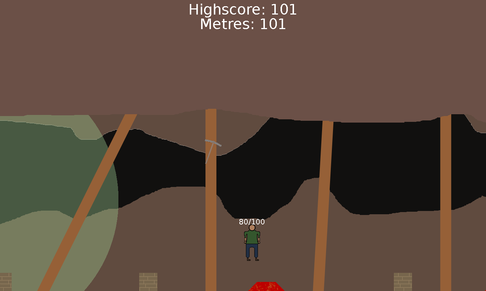
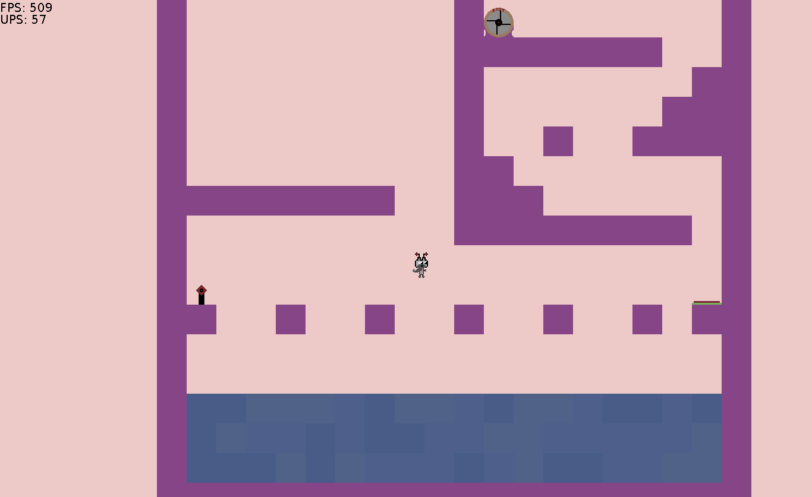
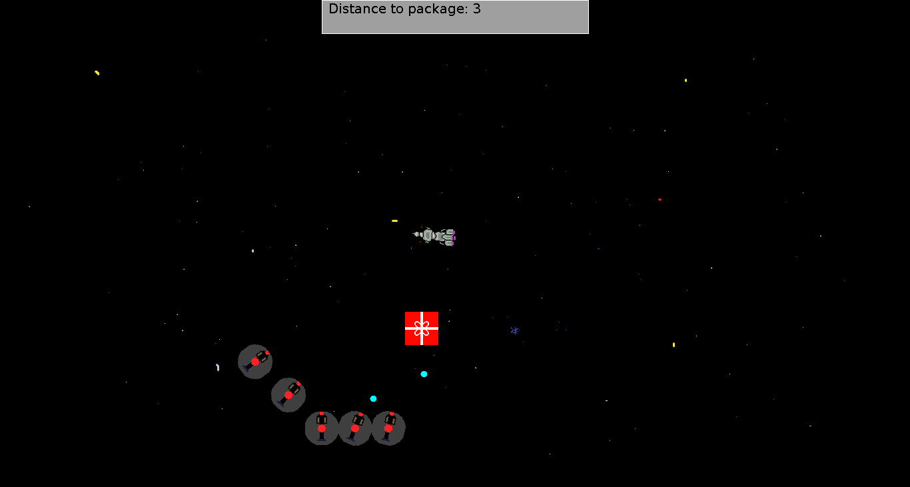
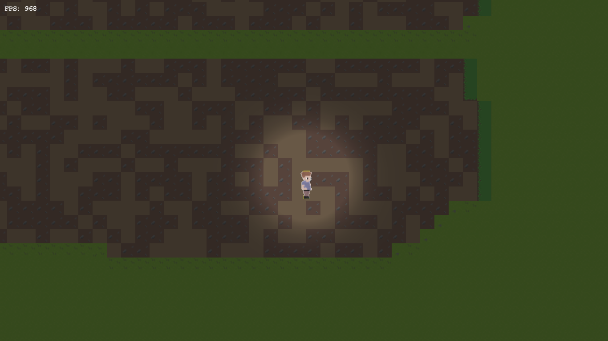

This page serves as an archive for some of the games I made throughout my school years.

I started learning to program with Java in 2012 by watching YouTube tutorials and reading Effective Java during downtime at school. I used Java to build all of my games, even hosting some of them as Java applets on a website I owned. I tended to enjoy building the engine more than creating a complete playable experience, so most of the games are lacking in content.

Thanks to [CheerpJ](https://cheerpj.com/), the games are now playable in-browser once more (at vastly reduced frame rates).

### Canary's Dead (2013)

[Play here](canarysdead/)

Canary's Dead is my first "complete" game. It is a simple endless runner where you have to jump over boxes to avoid being consumed by toxic gas that is following you.

The name is a reference to the traditional use of canaries in coal mines to alert to the presence of toxic gas. Canaries would succumb more quickly than humans, so if the canary died, you'd run.

### Canary's Dead 2 (2014)

[Play here](canarysdead2/)

Canary's Dead 2 is a remaster of the classic. Now with lava. This was built as a Java Applet and placed on my website for my Year 10 personal project.

### A to B (2014)

[Play here](atob/)

A to B is a game I made for my Year 10 personal project that was hosted on my website as a Java applet. It is a simple platformer with buttons, jump pads and invisible blocks. The playable character is named James, and is meant to be a vacuum going through company testing.

Work on a campaign was started but never finished, so the game consists of playable community levels built by my friends. Being teenagers, most of the levels were designed to frustrate by abusing invisible blocks. A level editor was available on my website for people to build levels, which they could send me to add to the game. No submissions were received.

### Zero-G (2014)

[Play here](zerog/)

Zero-G is a game I made with my friends during high school for the Monash University Computer Games Boot Camp IT Challenge Competition in 2014. The game is a basic shooter with a very short campaign and stick figure cutscenes. My friend Jarrod made [this 2-minute video](https://www.youtube.com/watch?v=47TBRaFLqZw) showing off the game, which was uploaded to the CGBC YouTube channel.

We made everything from scratch during our lunch breaks over the course of a few weeks. Images were made in Paint.NET, music was made in GarageBand, and the cutscenes were drawn in MS Paint. The game was built with the 2-Cylinder game engine I made for A to B.

### Unfinished Game (2018)

This is a game I started building during my uni break in 2018-19.

This was my first time using a graphics library. I used the slick2d library for rendering images, however built my own tile-based world system. While the game was written in Java, most content such as cutscenes and in-game events were going to be driven by scripts written in JavaScript interpreted with the Nashorn engine.

I spent a lot of time building nice systems, but not much time building an interesting game with them. Another case of being more interested in the engine than the game.
